

  

  
  

  Robert McAnany 2025

## DESCRIPTION

Solid Edge Storekeeper is a utility to create, organize, and share standard parts.  It is free and open source and you can find it [<ins>**Here**</ins>](https://github.com/rmcanany/SolidEdgeStorekeeper#readme).  

Fasteners, retainers, structural shapes, and more in ANSI and ISO format are included.  There are over 15k items available.  There is no database; everything is done in Excel.  It is fully customizable.  If you upgrade Solid Edge, no change to the program or its data is required.

The program handles two types of standard parts.  One consists of items like fasteners.  These are defined in dimension tables and created as needed.  The other consists of vendor-type items like pneumatic fittings.  Each of these has its own model file.  Both types are eligible for the handy automatic patterning option.

  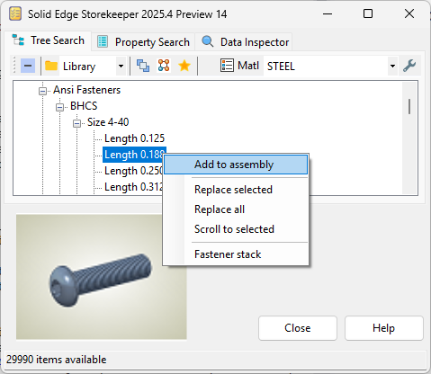

For items like fasteners, use **Tree Search**.  Navigate to the desired item, right-click and select `Add to assembly`.  If the item is already in your library, it is added to the assembly and the `Place Part` command is activated.  If not, it creates the new part, saves it to the library, then proceeds as above. 

  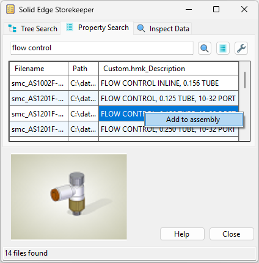

For vendor-type parts, use **Property Search**.  Enter the search terms, then click .  Locate the desired item on the list, then right-click and select `Add to assembly`.  Note, the program does not come with any of these; you're on you own for that.  Simply add what you need (and probably already have) to the library, in a subdirectory if you prefer.  

That's pretty much all there is to know about vendor type parts.  For the others, a bit more information follows.

You can set the file names according to your preference.  You can specify the material or any other SE file property.  File names and properties can accept formulas as input.  So you can do stuff like:

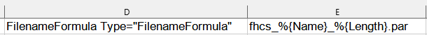

Structural shapes are not quite the same as fasteners.  While the cross section is standard, the length and the possiblity of additional features is not.  Usually the part doesn't even belong in the library.  So rather than assuming a name and location, the program prompts for both.

Unlike Family of Parts, files are only created as needed.  Also, each part is stand-alone, not tied back to a master file.

Unlike web-based offerings, the program is integrated with your parts library and works directly with Solid Edge.  It updates the properties you specify, using the naming conventions you define.  If you want adjustable parts (see the provided springs example), or any other SE-specific functionality, the program handles it like the native file that it is.

The program will never have every stardard part in the world, but it can be improved.  That's where **YOU** come in!  Contributions are welcome.  Please message me on the [<ins>**Solid Edge Forum**</ins>](https://community.sw.siemens.com/s/topic/0TO4O000000MihiWAC/solid-edge), or raise an [<ins>**Issue on GitHub**</ins>](https://github.com/rmcanany/SolidEdgeStorekeeper/issues), for ideas on how to get started.

## INSTALLATION

Please note there is some setup required before using the program.  After completing this step, check the **Setup** section below for details.

To install, do one of the following
- Download the [<ins>**Latest Release**</ins>](https://github.com/rmcanany/SolidEdgeStorekeeper/releases) (It will be at the top of the page)
- [<ins>**Clone the Project**</ins>](https://github.com/rmcanany/SolidEdgeStorekeeper) (See below to get the data and templates)

### Downloading the Latest Release

  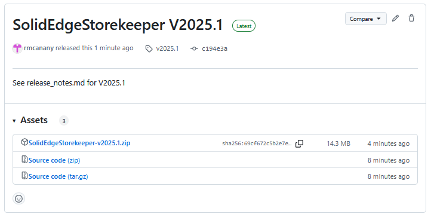

To get the latest release, click the file `SolidEdgeStorekeeper-VYYYY.N.zip`.  You may have to expand the Assets dropdown to see it.  Your browser should prompt you to save it. 

Choose a convenient location on your machine. Extract the zip file (right-click > Extract All).  Verify the directory is not blocked or read-only (right-click > Properties).  The program needs to be unblocked with write access to function properly.  

Double-click `Storekeeper.exe` to run.  The first time you do, you may get a `Windows Protected Your PC` message.  You can click `More Info` followed by `Run Anyway` to launch the program. 

### Cloning

The data and templates are not in the GitHub repo.  You need to download a Release to get them.  To make them available in your development environment, copy the `DefaultData`, `DefaultTemplates` directories to the locations where your compiled `Storekeeper.exe` is located.

On my machine, the executable resides in two places: `bin\Debug\net8.0-windows\` and `bin\Release\net8.0-windows\`.  I have copies of those directories in both places.

## SETUP

As noted earlier, some setup is required before using the program.  If you run Solid Edge in a localized language please be sure to see the information at the end of this section.

### Library
The program needs to know where to store the standard parts, and for fastener-like items, where to find the files defining their shape and spreadsheet containing their dimensions.

The storage location is called the library.  The default is in `Preferences\Library` under the Storekeeper main directory.  Note it is created the first time you run the program; it won't be there before that.  To change the location, click  on the **Tree Search** toolbar.  As noted above, if you want to access your vendor-specific standard parts, they must be in the library.  You can place them in one or more subdirectories if desired.

### Tree Search

The other settings for tree search are accessed on the Options dialog.  Click  on the toolbar to open it.  These are described next.

  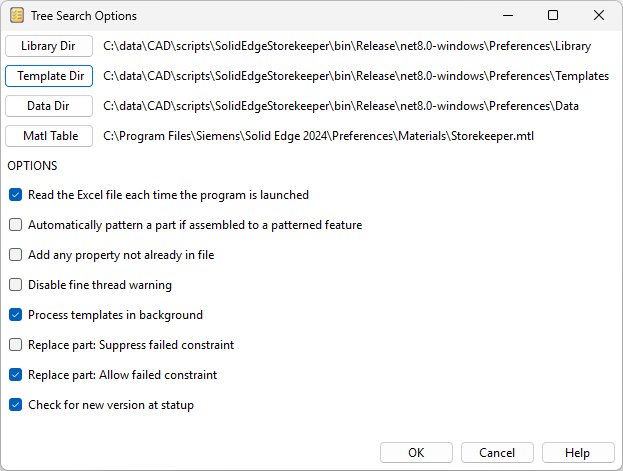

- **TEMPLATE DIRECTORY** 

The templates are SE part files that have variable-table-driven geometry to create new parts of a given type.  By default they are stored in the `Preferences\Templates` folder.  Note, the templates were created in SE2024.  They will only work if you're using that version or newer.

- **DATA DIRECTORY** 

The spreadsheet contains the variables required for each size of each type of part.  By default, it is stored in the `Preferences\Data` directory.  

- **MATERIAL TABLE** 

The material table is usually your normal SE material table.  However, for a quick test of the program, an alternative is to use `Storekeeper.mtl` from `Preferences\Templates`.  Copy it to your Solid Edge Materials directory to make it available.  On my machine, that location is `C:\Program Files\Siemens\Solid Edge 2024\Preferences\Materials`.  If you decide to continue using the program, you would eventually want to reconcile material names, face styles, etc. with your own standards. 
- **OPTIONS**
  - `Read the Excel file each time the program is launched`  
	Internally, the Excel file is parsed and saved in `*.xml` format.  If you haven't changed the Excel file, this is an unnecessary step.  Clearing this option tells the program to use the `*.xml` file it created previously.
  - `Automatically pattern a part assembled to a patterned feature`  
	Standard parts, especially fasteners, are often patterned after placement.  The program can detect if a face used to assemble the item is part of a pattern.  
	 
	This works with `Smart Patterns` and `User-Defined Patterns` (that's a hole with multiple hole circles in the profile).  It does not currently work with (the default) `Fast Patterns` unfortunately, unless you get lucky and pick the hole that was used to create the pattern.
  - `Add any property not already in file`  
	As mentioned above, besides creating geometry, the program can also update file properties.  Enabling this option tells the program to add any (custom) property that does not already exist in the file.
  - `Disable fine thread warning`  
	The program is currently unable to properly set the thread size for ANSI UNF external threads.  It warns you if that condition arises and provide instructions how to fix it.  Enabling this option suppresses that warning.
  - `Check for new version at startup`  
	If you don't need a reminder about new versions, disable the check here.

### Property Search

Additional settings for **Property Search** are accessed from that tab's toolbar.  Click the options button  to display the form.

  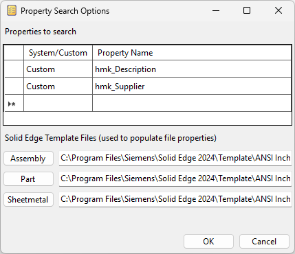

**Properties to Search**

This is where you enter the names of the properties that hold the values you want to match.  You must also specify if the property is System or Custom.  System properties are in every Solid Edge file.  Custom properties are ones you define, probably in a template.

**Solid Edge Template Files**

These are your normal template files, not the ones used by the program to create standard parts.  They are needed to populate the available properties, and to determine what language is in use.

### Localized SE Installations

You may have more work to do if you're not using English in Solid Edge.  In the spreadsheet `Storekeeper.xls`, there are some property names that probably need to be changed.

Open the file (located in the `Preferences\Data` directory) and look for entries like `%{System.Title}` and update as required.

## CUSTOMIZATION

The following is for those who want to customize the program.  You may want to do that eventually, but you can safely skip this section if you're just getting started.

### Organization

Earlier I referred to "a spreadsheet."  In reality there are multiple spreadsheets.  One, `Storekeeper.xls`, is the place where the overall layout of the data is handled.  The others are companion files that hold detailed information about a given category of parts.  These have names like `AnsiFasteners.xls`, `IsoStructural.xls`, etc.

While the use of Excel is handy, it's not all roses.  Representing an arbitrary-depth heirarchical tree is awkward, for one thing.  Here is how `Storekeeper.xls` is organized.

  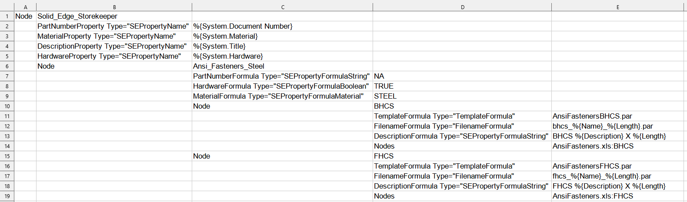

You'll see that the tree structure is represented by indenting.  The top node is `Solid_Edge_Storekeeper` and in this example its first child node is `Ansi_Fasteners_Steel`.  The first two child nodes under that are `BHCS` and `FHCS`.

In addition to child nodes under any given node, you'll notice other entries.  Those are some program attributes being set, and various properties being assigned.  More about properties in a bit.

In the image, the `BHCS` and `FHCS` nodes each have an entry, `Nodes` (plural).  That is one of those program attributes I just mentioned, and is the mechanism that tells the program to consult a companion spreadsheet tab for further information.  Here is a small portion of the companion data for Dowel Pins.

  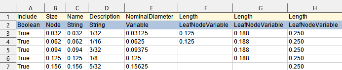

The rows represent different sizes, the columns represent values for a given size.  The first row holds the name for each value, the second holds its *type*.  The types `Variable` and `LeafNodeVariable` refer to variables in the template's variable table.

One other *type* not shown in the image is `ParameterString`.  That denotes a value that is passed to the template, but does not reside in the variable table, meaning there must be separate code to handle it.  Currently only `ThreadDescription` is supported.  See `AnsiFasteners.xls` for an example.

### Properties and Spreadsheet Variables

Now, let's look at the other entries in `Storekeeper.xls`, starting at the top.  

#### Top Level of the Tree

  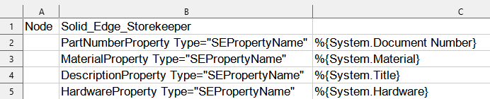

Here at the top level of the tree, we are defining spreadsheet variables for property names and the corresponding name in the Solid Edge file.  The location of the definition in the tree defines its scope.  Since these statements are at the top of the tree, they apply everywhere.

The syntax is horrible; that's how Xml likes it.  While Xml is a very flexible data-representation format, it is quite rigid in this regard.

#### Next Level Down

  

In this image, we are looking at a tree node one level below the top.  You'll see we are setting values for the part number, hardware status and material.  

The name of the spreadsheet variable has rules.  `XyzProperty` looks for `XyzFormula` to know how to proceed.  The prefix, `Xyz` in this case, can be anything you want (except for some reserved names shown below).  The suffix, `Property` and `Formula`, are the only valid choices.  

**Reserved Spreadsheet Variables**
- TemplateProperty
- TemplateFormula
- FilenameProperty
- FilenameFormula
- MaterialProperty
- MaterialFormula
- Node
- Nodes

So, for example to update the part number in the file, the program will use the information in `PartNumberFormula` to update the property defined in `PartNumberProperty`.  In this example that tells the program to make this assignment.

`%{System.Document Number} = "NA"`

#### One More Level Down

  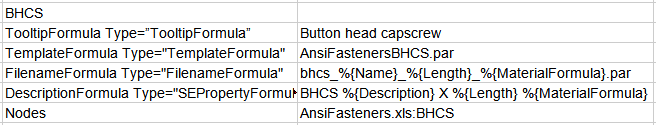

Here we are setting up the processing of button head capscrews.  You can see we need to specify what template to use and how to name the file.  We must also provide the companion spreadsheet name and the tab in that file where the information is stored.  

As mentioned previously, formulas can contain entries such as `%{Name}` and `%{Length}`.  Variables not proceeded by `System.` or `Custom.` are assumed to come from the companion spreadsheet.

In this example, we are also updating the description property.  That isn't necessary for the program to function.  It just illustrates how to update Solid Edge file properties.  Any property in the file can be updated in this way.  

## CREATING NEW TEMPLATES

You are of course free to create new templates any way you see fit.  However, if you plan to contribute your awesome work to the project, there are a couple of things to keep in mind.

  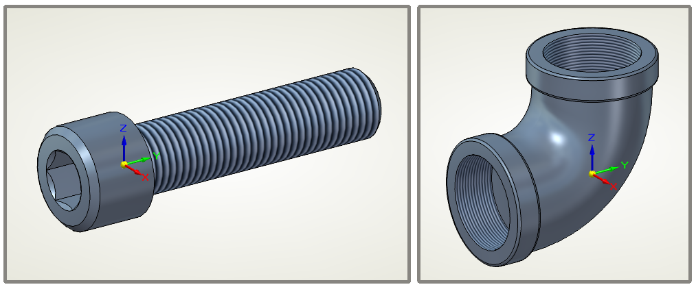

Many standard parts have a primary axis.  For consistency, consider orienting it along the Y Axis as shown.  For parts with a secondary axis like the pipe elbow, consider the Z Axis.

Another thing to think about is the effect of replacing one standard part with another.  It would be nice not to break assembly relationships.  For fasteners, I started with the socket head capscrew.  When it was time to create the next one, I did a Save As on that initial part and modified it as needed.  Since the head and body now have the same faces, Replace Part works without a hitch.

  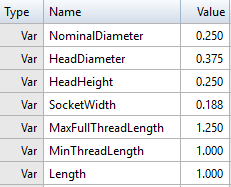

Variable names are something else to consider.  To minimize confusion in creating and maintaining the companion spreadsheets, see if you can reuse names that have been previously established.  You can check the supplied templates or spreadsheets to see what may apply to your parts.

## OPEN SOURCE PACKAGES

This project uses these awesome open source packages.

- JSON Converter [<ins>**Newtonsoft.Json**</ins>](https://github.com/JamesNK/Newtonsoft.Json)
- Excel reader [<ins>**ExcelDataReader**</ins>](https://github.com/ExcelDataReader/ExcelDataReader)
- Icons [<ins>**Icons8**</ins>](https://icons8.com)
