<div class="center">
  <p align=center>
  
  <p align=center>
  <span class="description">Robert McAnany 2026</span>
</div>

## CREDITS

**Contributors**  
@[Francesco Arfilli], @TeeVar, @Seva

**Beta Testers**  
@hawcad, @rob.wolbrink7456, @[Francesco Arfilli], @pedja, @TeeVar, @Seva

**Helpful feedback and bug reports**  
@SeanCresswell, @[Francesco Arfilli], @arekkul, @[Imre Szucs], @64Pacific, @Seva, @hawcad, @rob.wolbrink7456, @pedja, @TeeVar, @jpoat-seesai

*Feedback from users*

> OMG .....love your work buddy!

>  Management of standard parts is a huge use of my time and this may solve that!

> Thx, another great tool for SolidEdge​ Users!

> Cool tool!  I have been looking for something just like this.  (...) Great job, and making it open source is just extra good karma.

> Another excellent utility. Appreciate your contributions to the community. 

## DESCRIPTION

Solid Edge Storekeeper is a utility to create, organize, and share standard parts.  It is free and open source.  Please note the standard part templates were created with SE2024.  You will need that version or newer to use them.  (**Update 20251212:** **@TeeVar**, generously contributed a set of templates created with SE2019.)  (**Update 20260721:** Most parts have been modified with SE2025; that's the earliest version you can now use for the SE2024 dataset.)

Fasteners, retainers, structural shapes, and more in ANSI and ISO format are included.  There are over 30k items available.  There is no database; all the data is in Excel.  It is fully customizable.  If you upgrade Solid Edge, no change to the program or its data is required.

The program handles two types of standard parts.  One consists of items like fasteners.  These are defined in dimension tables and created as needed.  The other consists of vendor-type items like pneumatic fittings.  Each of these has its own model file.  Both types are eligible for the handy automatic patterning option (see separate section below for details).

### Tree Search

<p align="center">
  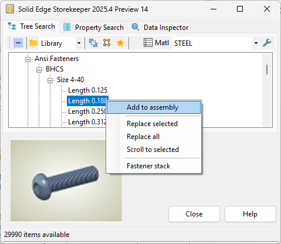
</p>

For items like fasteners, use **Tree Search**.  Navigate to the desired item, select a material, then right-click and choose an action. If the part is not already in the library, the program creates it.  The possible actions are:

- `Add to assembly`  Adds the part to the assembly and activates the `Place part` command.
- `Replace selected`  Replaces a selected part in the assembly.
- `Replace all`  Replaces all occurrences of a selected part in the assembly.
- `Scroll to selected`  Scrolls the tree to the selected part in the assembly.
- `Fastener stack`  Opens the fastener stack dialog.  See the separate section below for details.

### Property Search

<p align="center">
  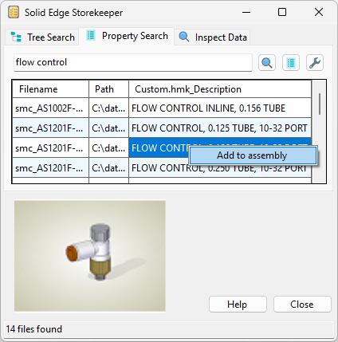
</p>

For vendor-type parts, use **Property Search**.  Enter the search terms, then click .  Locate the desired item on the list, then right-click and select an action.  The possible actions are: 

- `Add to assembly`, `Replace selected`, `Replace all`  Same as above.
- `Open`  Opens the selected file in Solid Edge.
- `Open folder`  Opens the file's directory in Windows File Explorer.

Note, the program does not come with any vendor-type parts; you're on you own for that.  Simply add what you need (and probably already have) to the library, in a subdirectory if you prefer.  

That's pretty much all there is to know about vendor type parts.  For the others, a bit more information follows.

You can set the file names according to your preference.  You can specify the material or any other SE file property.  File names and properties can accept formulas as input.  So you can do stuff like:

<p align="center">
  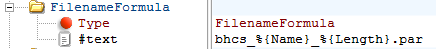
</p>

Structural shapes are not quite the same as fasteners.  While the cross section is standard, the length and likelihood of additional features is not.  Usually the part doesn't even *belong* in the library.  For these, you can change the `Save in` option from `Library` to `Assy Dir` or `Other`.  The program prompts for a filename, and for `Other`, a location.

### Who Needs This Program?

Me, for one.  What makes it different?  First, it's free and open source, and is actively maintained.  It beats the pants off of scrolling through massive directories in Windows File Explorer.  You're in control -- any part it creates belongs to you, and is stored where you want.  It's customizable, has no database, and doesn't care if you upgrade Solid Edge.

Also, unlike Family of Parts, files are only created as needed.  Each part is stand-alone, not tied back to a master file.

Unlike web-based offerings, the program is integrated with your parts library and works directly with Solid Edge.  It updates the properties you specify, using the naming conventions you define.  If you want adjustable parts (see the provided springs example), or any other SE-specific functionality, the program handles it like the native file that it is.

Finally, it has a secret weapon -- all of us.  Contributions are welcome!  Please message me on the [<ins>**Solid Edge Forum**</ins>](https://community.sw.siemens.com/s/topic/0TO4O000000MihiWAC/solid-edge), or raise an [<ins>**Issue on GitHub**</ins>](https://github.com/rmcanany/SolidEdgeStorekeeper/issues), for ideas on how to get started.

Uh-oh.  The Marketing guy just showed up.  He wants to *"Synergize our stakeholders and leverage this cross-promotion opportunity"*.  I bet he does.

>  *Hello there!! I'm Big Mike!  Do you want to do things better and faster with less work?!  Of course you do!  That's why you need [<ins>**Solid Edge Housekeeper**</ins>](https://github.com/rmcanany/SolidEdgeHousekeeper#readme)!*

>  *Is it free and open source?!  Yes!  Is it a batch utility?!  YES!!  Does it find annoying little errors in your project?!  YES YES YES!!!!  You are going to LOVE IT!!*

Sorry about that.  Let's move on.

## INSTALLATION

Please note there is some setup required before using the program.  After completing this step, check the **Setup** section below for details.

To install, do one of the following
- Download the [<ins>**Latest Release**</ins>](https://github.com/rmcanany/SolidEdgeStorekeeper/releases) (It will be at the top of the page)
- [<ins>**Clone the Project**</ins>](https://github.com/rmcanany/SolidEdgeStorekeeper) (See below to get the data and templates)

### Downloading the Latest Release

<p align="center">
  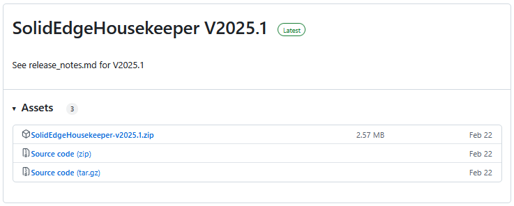
</p>

To get the latest release, click the file `SolidEdgeStorekeeper-VYYYY.N.zip`.  You may have to expand the Assets dropdown to see it.  Your browser should prompt you to save it. 

Choose a convenient location on your machine. Extract the zip file (right-click > Extract All).  Verify the directory is not blocked or read-only (right-click > Properties).  The program needs to be unblocked with write access to function properly.  

Double-click `Storekeeper.exe` to run.  The first time you do, you may get a `Windows Protected Your PC` message.  You can click `More Info` followed by `Run Anyway` to launch the program. 

### Cloning

The data and templates are not in the GitHub repo.  You need to download a Release to get them.  To make them available in your development environment, copy the directories `DefaultData*` and `DefaultTemplates*` to the locations where your compiled `Storekeeper.exe` is located.

On my machine, the executable resides in two places: `bin\Debug\net8.0-windows\` and `bin\Release\net8.0-windows\`.  I have copies of those directories in both places.

## SETUP

As noted earlier, some setup is required before using the program.  If you run Solid Edge in a localized language please be sure to see the information at the end of this section.

### Tree Search Toolbar

Most options are set on the **Tree Search Options** page (see next), but those most frequently-used are located on the toolbar itself.

<p align="center">
  
</p>

-  `Collapse`  
Closes all open nodes in the tree.

-  `Save in`  

  - `Library`  The standard location for library parts.
  - `Assy Dir`  The same location as the assembly file currently open in Solid Edge.
  - `Other`  Anyplace else.

-  `Always on top`  
Keeps Storekeeper on top of other windows.  Click to toggle.

-  `Auto pattern`  
Enables automatic patterning.  Click to toggle.  See separate section below for details.

-  `Favorites only`  
Shows only your favorites in the tree.  Click  to toggle.  See separate section below for details.

-  `Matl`  
Available materials for the selected part.  If an item only has one material defined, it is selected automatically.  If you go to a different item in the tree and its material list contains the currently active material, the selection is retained.  

-  `Tree search options`  (see next).


### Tree Search Options

The program needs to know where to store the standard parts, and for fastener-like items, where to find the files defining their shape and spreadsheet containing their dimensions.

<p align="center">
  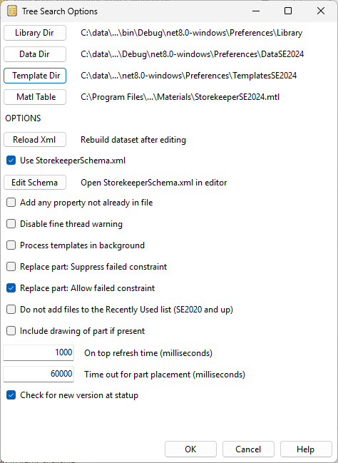
</p>

- **LIBRARY DIRECTORY**  
The library is where the standard parts you create are stored.  The default is in `Preferences\Library` under the `Storekeeper` main directory.  

  Note the directory is created the first time you run the program; it won't be there before that.  As noted above, if you want to access your vendor-type standard parts, they must be in the library.  You can place them in one or more subdirectories if desired.

- **DATA DIRECTORY**  
The spreadsheet contains the variables required for each size of each type of part.  By default, it is stored in the `Preferences\DataSE2024` directory. 

  Change the data directory to `Preferences\DataSE2019` if you want to use the alternative templates.  

- **TEMPLATE DIRECTORY**  
The templates are SE part files that have variable-table-driven geometry to create new parts of a given type.  By default they are stored in the `Preferences\TemplatesSE2024` folder.

  As noted at the outset, the original templates were created in SE2024.  They will only work if you're using that version or newer.  (**UPDATE 20260607:** It is now SE2025.)  An alternative set of templates, created with SE2019, was generously contributed by **@TeeVar**.  To use them, change the template directory to `Preferences\TemplatesSE2019`.  

  Even if you have a newer version of Solid Edge, you may still want to use the SE2019 templates.  Unlike me, **@TeeVar** is an ISO native speaker.  If you work with that standard, his naming conventions will probably be more familiar and useful to you.

  Note, the templates and the spreadsheet that drives them go together.  If you change one, you have to change the other.

  You don't have to stick with your first choice, by the way.  You can switch between the original and alternative templates at any time.

- **MATERIAL TABLE**  
The material table is usually your normal SE material table.  However, for a quick test of the program, an alternative is to use `StorekeeperSE2019.mtl` or `StorekeeperSE2024.mtl` found in their respective `Templates` directory.  Copy one or both to your Solid Edge Materials directory to make it available.  On my machine, that location is `C:\Program Files\Siemens\Solid Edge 2024\Preferences\Materials`.  

  If you decide to continue using the program, you would eventually want to utilize your own material table, updating material names in the spreadsheet and templates as needed. 

- **OPTIONS**

  - `Reload Xml`  
	Rebuilds the tree from the dataset.
	 
  - `Use StorekeeperSchema.xml`  
	This tells the program the format of file to process when building the tree.  The only reason to disable it is if you are converting an old `Storekeeper.xls` to the new format.
	 
  - `Edit schema`  
	Opens `StorekeeperSchema.xml` in the Xml editor.  See [<ins>**Editing the Schema File**</ins>](#editing-the-schema-file) for details.
	 
  - `Read the Excel file each time the program is launched`  
	For datasets using the previous tree-structure definition file, `Storekeeper.xls`.  Now, only used when converting an old file to the new format.

  - `Add any property not already in file`  
	As mentioned above, besides creating geometry, the program can also update file properties.  Enabling this option tells the program to add any (custom) property not already in the file.
	
  - `Disable fine thread warning`  
	The program is currently unable to properly set the thread size for ANSI UNF external threads.  The program logs a warning if this occurs.  Enabling this option suppresses that warning.
	
	The condition can cause issues with interference checking.  Fixing it is optional.  To do so, open the file and edit the Thread definition.  On the Parameters Step, you'll note the size designation is followed by an asterisk (*).  Click the drop down and select the one without it.
	
<p align="center">
  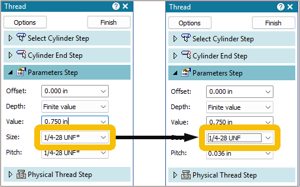
</p>

  - `Process templates in background`  
	A new part must be opened in Solid Edge to update its parameters.  This setting tells the program to not display it in the user interface.

	Note, processing in background does not support `Fit View`.  If you need usable thumbnail images, this option is probably not for you.  Also, there is an issue when creating a part whose units do not match the default units of your Solid Edge installation.  Processing in background appears to ignore the file's unit setting.
	
  - `Replace part: Suppress failed constraint`  
	When using the `Replace` command, some constraints may fail to get resolved.  If this occurs, this option tells the program to suppress the constraint.
	
  - `Replace part: Allow failed constraint`  
	With the same situation as above, this option tells the program to leave the constraint in the failed state.  This is my preferred setting.  The pathfinder shows a red lightning bolt, alerting me that I need to fix something.
	
  - `Do not add files to the Recently Used list`  
	Enable this option to keep the program from adding newly-generated standard parts to the Most Recently Used list.  Note this ability was added to Solid Edge in version 2020.  If you are running an earlier version, it has no effect.
	
  - `Include drawing of part if present`  
	If a file in the templates directory has a drawing with the same name, the program can copy it to the library along with the part.  Enable this option to do so.

  - `On top refresh time (milliseconds)`  
	If the `Always on top` option is enabled, this setting controls the maximum time between checks.

  - `Time out for part placement (milliseconds)`  
	If more time than this setting has passed for the `Place Part` command to complete, it is interrupted.  This is needed to avoid an infinite loop in the program.  Set it so you have ample time to constrain the part in the assembly.
	
  - `Check for new version at startup`  
	If you don't need a reminder about new versions, disable the check here.

### Property Search Options

Additional settings for **Property Search** are accessed from that tab's toolbar.  Click the **Property Search Options** button  to display the form.

<p align="center">
  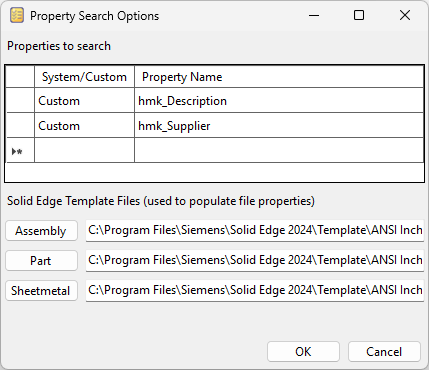
</p>

#### Properties to Search

This is where you enter the names of the properties that hold the values you want to match.  You must also specify if the property is System or Custom.  System properties are in every Solid Edge file.  Custom properties are ones you define, probably in a template.

#### Solid Edge Template Files

These are your normal template files, not the ones used by the program to create standard parts.  They are needed to populate the available properties, and to determine what language is in use.

#### Options

- `Cache library file properties for faster search`  
  Reads all file properties and saves them in a separate file.  This can speed up searches for large libraries.  It takes some time to load the file initially; the status bar informs you of the progress.

### Localized SE Installations

You may have more work to do if you're not using English in Solid Edge.  In the tree data file `StorekeeperSchema.xml`, there are some property names that probably need to be changed.  See **Editing the Schema File** (next).

Open the file and look for entries like `%{System.Title}` and update as required.

### Editing the Schema File

`StorekeeperSchema.xml` is just a text file, you can edit it in Notepad.  A easier way is to use an XML editor.  I use the free and open source `XMLNotepad`.  It was created and is actively maintained by Microsoft.  Here are a couple of links if you want to check it out.

[<ins>**Home Page**</ins>](https://microsoft.github.io/XmlNotepad/), 
[<ins>**Download**</ins>](https://microsoft.github.io/XmlNotepad/#install/), 
[<ins>**Tutorial**</ins>](https://www.youtube.com/watch?v=bmchxiu_oV0) (from the package author), and 
[<ins>**Help Documentation.**</ins>](https://microsoft.github.io/XmlNotepad/#help/overview/)

Note, this is a quick overview of how to work with the `schema` file.  For details, see the [<ins>**Customization**</ins>](#customization) section below.

#### Setting up the Editor

You can launch your Xml editor from Storekeeper.  On the **Tree Options Page**, click the `Edit schema` button.  The first time you do, it will ask you to navigate to the executable.

The location was probably chosen by the installer, not you.  The program tries to help.  It first looks for `XMLNotepad`; if found, it opens the location of `XmlNotepad.exe`.  If not, the dialog provides a search box; you could try that.  By the way, for (regular) Notepad, try looking here: `C:\Windows\notepad.exe`.

If you change the file, make sure to save before closing.  Then to update, click the `Reload Xml` button.

To change your choice of editor, \<SHIFT>-click the `Edit schema` button.

#### Find/Replace

To update text across the whole file, use `Edit > Replace`.  To keep from messing up Xml metadata, set the `Search Filter` to `Text`.

<p align="center">
  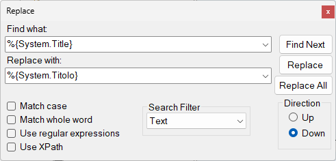
</p>

#### Add Items

Add new items to the dataset using copy/paste.  Right click an item and select Copy.

<p align="center">
  
</p>

Then scroll up to the category header, right click it and select Paste.

<p align="center">
  
</p>

Change the name and enter the relevant information.  To move it to a new location, drag it up or down the tree.

<p align="center">
  
</p>

#### Remove Items

To delete an item, select it and hit the Delete key.

<p align="center">
  
</p>

#### Creating a New Category

You can copy/paste entire categories.  The provided dataset has one, `Custom_Demo`, meant for that purpose.  Recall for the paste step, you choose the node under which the copied item is to appear.  In this case that would probably be the root, `Solid_Edge_Storekeeper`.

## AUTOMATIC PATTERNING

Standard parts, especially fasteners, are frequently patterned after placement.  If this option is enabled and the feature to which a part has been assembled is a member of a pattern, the program attempts to pattern the part.  There are currently a couple of limitations.  

- It works in SE2024 and SE2025.  It does not work in SE2019 or SE2021.  Other versions have not been tested.

- It works with `Smart Patterns` and `User-Defined Patterns` (that's a hole with multiple hole circles in the profile).  It does not work with (the default) `Fast Patterns` unfortunately, unless you get lucky and pick the hole that was used to create the pattern.

- It is sometimes unable to create a pattern when placing a fastener to a part located in a subasembly.  In some cases, it helps to save the top-level assembly and try again.

## FAVORITES

As mentioned above, in the tree search panel, you can have all available parts shown, or just your favorites.

For entire categories, edit	`StorekeeperSchema.xml`.  (To learn an easy way to edit the file, see [<ins>**Editing the Schema File**</ins>](#editing-the-schema-file).)  Set the `FavoritesFormula` `#text` as needed.

<p align="center">
  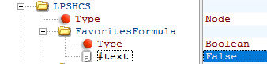
</p>

For the `companion spreadsheets`, it is a line by line choice.

<p align="center">
  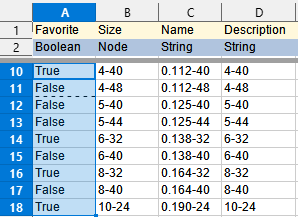
</p>


## FASTENER STACK

A fastener stack is a grouping that consists of a fastener and related components, such as washers and nuts.  To create one, on the `Tree Search` dialog, right-click a fastener and select the `Fastener stack` command.  The following form is shown.

<p align="center">
  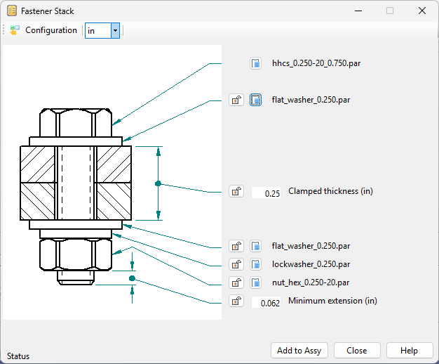
</p>

### Configuration and Use

To select the stack style, click the `Configuration` button.  There are eight versions that employ nuts, and four each for thru- and blind-tapped holes.  (The lone configuration on the last row is exclusively for ASME Flange studs.  See below for more details on that.)

Note, you only choose the fastener.  The related components are automatically selected based on the fastener diameter and thread.

<p align="center">
  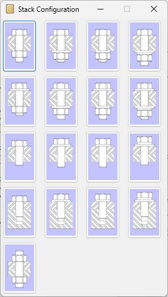
</p>

Once the desired configuration is selected, choose the units and enter the appropriate parameters.  Click `Add to Assy` to start the process.  

The program first searches the library for a fastener length that meets the criteria.  If none is found, an error is diplayed.

If a fastener is found, the program then opens separate temporary subassemblies for the top and bottom parts of the stack, and populates them with the components required for the chosen stack style.

Next, it adds each updated subassembly, in turn, to the main assembly.  The subassembly is dispersed into the main assembly and the `Place part` command is activated.

The program waits for the `Place part` command to finish before proceeding.  Confusingly, the command does not automatically finish when the parts have been fully constrained.  You have to right-click the mouse to finish.  If you notice nothing happening for a while, the program could be waiting for your input.

After the components are placed, they are converted to an `Assembly group`.  Finally, the group is patterned if applicable, assuming that option is enabled.

### Getting Parameters

The parameters `Minimum thread engagement` and `Minimum extension` are design decisions and left up to you.  `Clamped thickness` and `Thread depth` are parameters of the model.  Adding an easy way to get those is on the roadmap, but not currently implemented.

Today, for `Clamped thickness`, the quickest way may be to use the Solid Edge `Measure Distance` command.  It is on the Inspect Tab > 3D Measure Group.

<p align="center">
  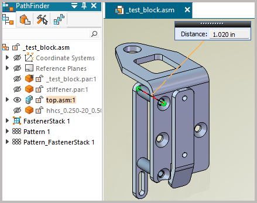
</p>

To get `Thread depth` on blind holes, one way is to change selection priority from `Part` to `Face` with `CTRL+SpaceBar`, then select the threaded hole.  On the shortcut menu, select `Edit Definition` and check the setting on the Options page of the Hole dialog that appears.

<p align="center">
  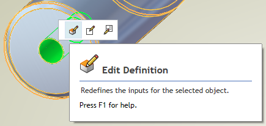
</p>

### ASME Flange Studs

These are a bit different than other fasteners.  They are not chosen by dimensions, but rather according to the ASME B16.5 standard, by pressure rating and pipe size.  Also, you won't find them in the Ansi Fastener section of the tree.  They are under Ansi Piping, along with the flanges that use them.

<p align="center">
  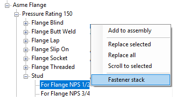
</p>

As shown in the Configuration section above, they have their own stack configuration.  Storekeeper will do weird things if it is not the one selected.  To center the stud on the flange, the program uses the clamped thickness; so it's important to enter that value correctly.

Also according to the standard, heavy hex nuts are used, not the usual variety.  That is handled automatically, but means those components must be available, which they are in the SE2024 dataset.

One more thing about the studs.  As delivered, Storekeeper names the files like so: 

`asme_b16.5_stud_%{Name}_%{Length}_%{MaterialFormula}.par`

The `Length` variable is in inches.  In the companion spreadsheet `AsmeB16.5Fasteners.xls` there is a column, `mmLength`, with the equivalent in millimeters.  The values are rounded according to the standard (eg 2.250" -> 55mm).  You can use that one for naming if desired.

### Changing the Related Components

In Storekeeper's `Preferences` directory, there are three files for each of the supplied datasets, `FlatWasher.json`,`LockWasher.json`, and `Nut.json`.  

Here are the default contents of `FlatWasherSE2024.json`.

`["Solid_Edge_Storekeeper\\Ansi_Fasteners\\Washer_Flat","Solid_Edge_Storekeeper\\Iso_Fasteners\\Washer_Flat"]`

As you may recognize, it is a comma-delimited list in `JSON` format.  You can edit the files in Notepad to point to the desired node(s) in the `*.xml` tree.

## PRE-POPULATING THE LIBRARY

**Note, this feature is temporarily disabled.  It does not yet support multiple materials per category.**

You can add items to the library ahead of time.  Enable the `Pre-populate` checkbox to get started.  

Note, for items with multiple materials available, the material must be selected before starting this process.  Click on an applicable item and select the desired material when prompted.

<p align="center">
  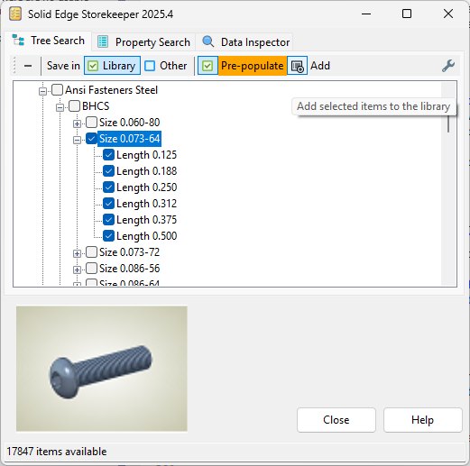
</p>

To select an item, enable its checkbox.  Enabling the checkbox of a category header will select all items (including subcategories) below it.  You can select a category, then de-select any items you don't want included.  

Once satisfied with the selection, click `Add to library` to start the process.  After you do, the `Close` button text changes to `Stop`.  Click that to stop processing.  It may take a few seconds to register.  It doesn't hurt to click it twice.

To avoid confusion, the `Add to assembly` shortcut is disabled in this mode.  Uncheck `Pre-populate` to get it back.

One handy feature missing in the `TreeView` control is `Multiselect`.  That means you cannot select a range with click followed by SHIFT-click.  It may be possible to add code to implement it, but it's not available now.


## CREATING NEW TEMPLATES

You are of course free to create new templates any way you see fit.  However, if you plan to contribute your awesome work to the project, there are a couple of things to keep in mind.

<p align="center">
  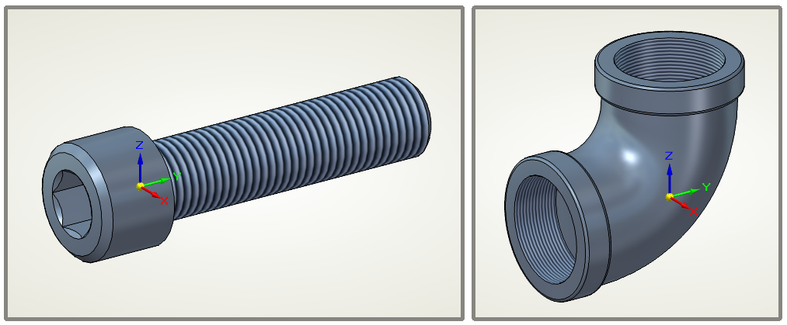
</p>

### Primary Axis

Many standard parts have a primary axis.  For consistency, consider orienting it along the Y Axis as shown.  (This orientation was chosen to provide a more informative thumbnail image.)  For parts with a secondary axis like the pipe elbow, consider the Z Axis.

### Replace Part Considerations

Another thing to think about is the effect of replacing one standard part with another.  It would be nice not to break assembly relationships.  For fasteners, I started with the socket head capscrew.  When it was time to create the next one, I did a Save As on that initial part and modified it as needed.  Since the head and body now have the exact same faces, Replace Part works as expected.

### Variable Names

<p align="center">
  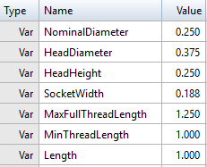
</p>

Variable names are something else to consider.  To minimize confusion in creating and maintaining the companion spreadsheets, see if you can reuse names that have been previously established.  You can check the supplied templates or spreadsheets to see what may apply to your parts.

While variable names for individual parts are pretty independent from each other, Fastener Stacks are a different story.  To find related files, the program looks for specific names, like `NominalDiameter` or `Length`.  If you want to use this functionality on your parts, those names must match the supplied templates.

### Drawings of Standard Parts

As mentioned above, drawings of standard parts is a supported option.  If you need that, simply create a drawing with the same name as the template.  

If the program finds such a drawing, and the option is enabled, it copies it to the library, renames it and updates the links.  Enable the option `Include drawing of part if present` on the **Tree Search Options** page.

### Thread Pitch

One last thing about creating a new template.  Storekeeper has the ability to adjust the thread texture to match the pitch.  It's just eye candy and not required.  However, if you would like that feature, there is a bit of setup to make it work.  

In your standard parts templates, set up the FaceStyle as shown below.  Note especially `Units` and `Scale X`.  The program will not work correctly if these settings do not match.  If the part has internal threads, you can enable `Mirror X` to avoid left-hand looking threads.

<p align="center">
  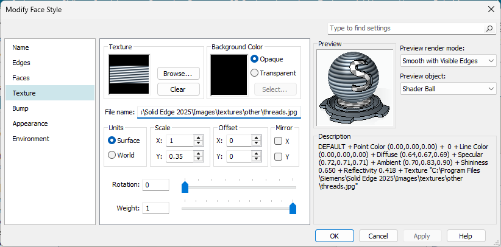
</p>

The `Scale Y` parameter is what the program adjusts to match the pitch of the part being generated.  You can just eyeball it for the template.  Or, if you prefer a calculation, here's how the program does it:

```
If IsAnsi(ThreadDescription) Then
    Pitch = GetAnsiPitch(ThreadDescription) ' 1/TPI
End If
If IsIso(ThreadDescription) Then
    Pitch = GetIsoPitch(ThreadDescription) ' Handles unspecified pitch for M1-M100
End If

Dim NumThreads As Double = ThreadTextureLength / Pitch

ThreadFaceStyle.TextureScaleY = CSng(7 / NumThreads)
```

Storekeeper needs to know the length of the thread.  Rather than making the program try to figure it out, you supply it explicitly in the template's variable table.  The variable must be called `ThreadTextureLength`.  You supply a formula from the other parameters to set it.  Take a look at `AnsiFastenersBHCS.par` and `AnsiFastenersNutHex.par` for a couple of examples.

## CUSTOMIZATION

The following is for those who want to customize the program.  You may want to do that eventually, but you can safely skip this section if you're just getting started.

Storekeeper stores data in two different ways.  One of these defines the tree structure used to navigate the standard parts.  This is called the `schema`.  The other holds the data for those parts.  This is called `companion data`, or usually, `companion spreadsheets`.

Neither are difficult, but there's more to say about the `schema`, so let's get the `companion spreadsheets` out of the way first.

### Companion Spreadsheets

Here is the companion spreadsheet `AnsiFasteners.xls`.  You'll notice tabs across the bottom.  Each of those holds information for a specific type of fastener.  The one currently showing is for hex head capscrews.  

<p align="center">
  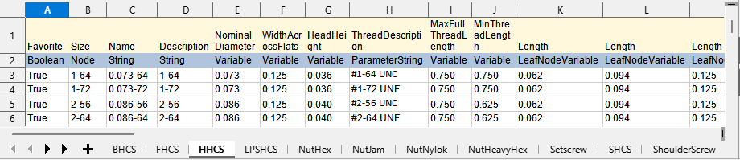
</p>

The rows represent different sizes, the columns represent values for a given size.  The first row holds the name for each value, the second holds its *type*.  The first column lets you identify your favorite parts as discussed above.

The different *types* tell the program how they are to be used.

- `Node`  This defines an entry in the tree, and provides the text to be displayed.
- `Variable`  This refers to entries in the template's variable table.  The column and variable names must match.
- `LeafNodeVariable`  This also refers to a variable name in the file.  It is a kind of "secondary" variable.  In this case, it says there are multiple lengths available for a given size.  Each of those appears as a separate node in the tree.
- `ParameterString`  This denotes a value that is needed in the template, but does not reside in the variable table.  For those,  there must be separate code to handle it.  Currently only `ThreadDescription` is supported.  
- `String`  This is free-form text that can be referenced in the schema file for file name and other formulas.
- `Boolean`  This is only used for `Favorites`.  It is more or less redundant.

### Schema

Unlike the `companion spreadsheets`, the tree structure is defined in an XML file.  Previously a spreadsheet was used for this purpose; it was horrible.  If you have a customized spreadsheet from previous versions, you can convert it to the new format.  See the separate section below.

The `schema` file is called `StorekeeperSchema.xml`.  The program looks for it in `Preferences\DataSE2019` or `Preferences\DataSE2024`.  

Here's a view of the tree in XMLNotepad.

<p align="center">
  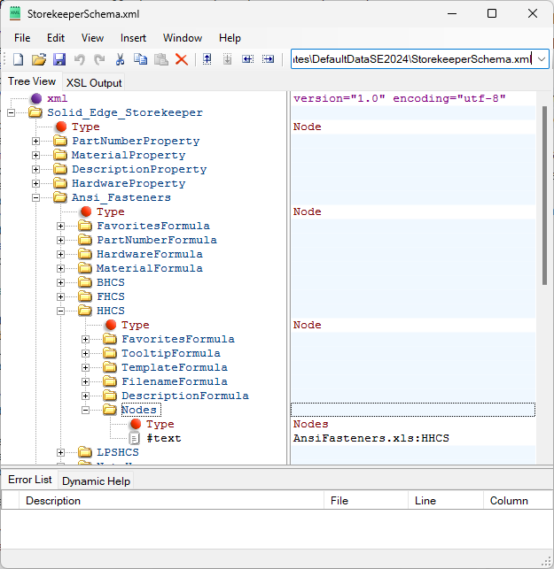
</p>

The top node is `Solid_Edge_Storekeeper` and in this example its first child node is `Ansi_Fasteners`.  The first two child nodes under that are `BHCS` and `FHCS`.

In addition to child nodes under any given node, you'll notice other entries.  Those are some program attributes being set, and various properties being assigned.  More about that next.

In the image, the `HHCS` node has an entry, `Nodes` (plural).  That is one of those program attributes just mentioned.  It is the mechanism that links the tree to the `companion spreadsheets`.

#### Properties and Program Attributes

Now, let's look at the other entries in `StorekeeperSchema.xml`, starting at the top.  

<p align="center">
  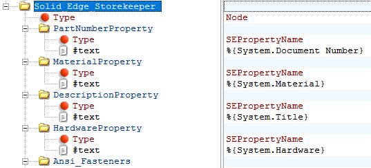
</p>

Here, we are defining property names and the corresponding name in the Solid Edge file.  The location of the definition in the tree defines its scope.  Since these statements are at the top of the tree, they apply everywhere.

Now, the next level down.

<p align="center">
  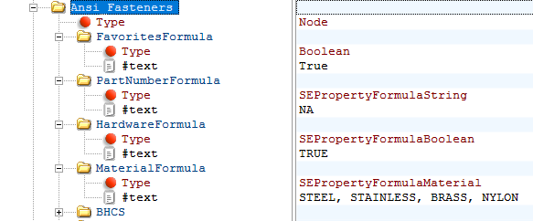
</p>

You can see we are setting values for the part number, hardware status and material.  

The name of the property has rules.  `XyzProperty` looks for `XyzFormula` to know how to proceed.  The prefix, `Xyz` in this case, can be anything you want (except for some reserved names shown below).  The suffix, `Property` and `Formula`, are the only valid choices.  

**Reserved Property Names**
- TemplateFormula
- FilenameFormula
- MaterialProperty
- MaterialFormula
- Node
- Nodes
- TooltipFormula
- FavoritesFormula

So, for example to update the part number in the file, the program will use the information in `PartNumberFormula` to update the property defined in `PartNumberProperty`.  In this example that tells the program to make this assignment.

`%{System.Document Number} = "NA"`

The `MaterialFormula` property is slightly different from the others.  Its value can be a comma-delimited list.  For example,

`STEEL`,`STAINLESS`,`STAINLESS\, PASSIVATED`,`BRASS`

If the material name itself contains a comma, preceed it with a backslash as shown.  A comma-delimited list requires special handling.  This is currently the only property that supports it.  

One last thing about the `MaterialFormula`.  It can occur in multiple places in the tree.  The bottom-most definition is the one that is used.  That allows you to set a default definition, say for all fasteners, then redefine it lower in the tree for any item with different options.

Getting back to our example, let's look at the lowest level in this branch of the `schema`.

<p align="center">
  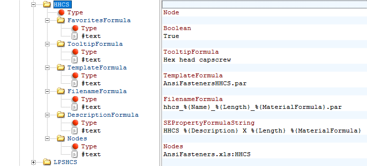
</p>

Here we are setting up the processing of hex head capscrews.  You can see we need to specify what template to use and how to name the file.  As mentioned, we must also provide the companion spreadsheet name and the tab in that file where the information is stored.  

Formulas can contain entries such as `%{Name}` and `%{MaterialFormula}`.  Variables are *populating* the part file, not *reading from it*.  That means you cannot retrieve a property from a Solid Edge file like `%{Custom.Engineer}`.  Variables can only come from `StorekeeperSchema.xml` or a `companion spreadsheet`.

In this example, we are also updating the description property.  That isn't necessary for the program to function.  It just illustrates how to update Solid Edge file properties.  Any property in the file can be updated in this way.  

#### Syntax

XML is very picky about syntax in the tag definitions.  A tag is anything that appears on the left pane of the interface, like `Ansi_Fasteners` or `PartNumberFormula` for example.

It is not at all picky about text associated with the tag, like the file name and other information shown above.

A valid tag name can only have letters, numbers, `_` (underscore), `.` (period), and `-` (minus).  It can't start with a number, or have space characters in it.  (Not sure about other alphabets.)

That means "good luck" with things like this: `1/4-20 x 1.000`.

Since I *want* things like that, we developed a workaround.  For illegal characters, we made "stand-ins" that are translated by Storekeeper when building the tree view of the library.  (The tree view is a Control in WinForms, not the underlying XML itself.  It is not picky about such things.)

You can't start with a number.  To get around that, prepend it with some text.  In the companion spreadsheets, that is done automatically by adding the Node name to the entry.  Keeping with the example, that gets us this far: `Size 1/4-20 x 1.000`.

For the space character, use `_` which is allowed.  Replace all other punctuation using the lookup table (below).  Instead of `/`, enter `.XmlForwardSlash.`.  Note the `.` before and after the name are part of the stand-in text.  You have to use them.

In this example to get `Size 1/4-20 x 1.000` in the tree, the XML would be `Size_1.XmlForwardSlash.4-20_x_1.000`.

It's kind of a pain and there may be a better way.  That's how it works for now, though.

The code that builds the lookup table is below.  First, a couple of things to note.  

- Any line preceeded by `'` (single quote) in the code is ignored.  Either because the character is already allowed, or you can't use it for other reasons.

- Any character not in the lookup table, for example `€` (Euro symbol), will not be translated.  It has to be on the list.  Let me know if you need one and I'll add it.

- You might be wondering why we haven't had to worry about all this before.  That is because previously Excel was used for everything.  When the program parses spreadsheets, it makes the necessary replacements automatically.  Since this new method *starts* with XML, we have to deal with it.  (Except the companion spreadsheets, which remain in Excel format.)

- One nice thing about XMLNotepad is that it won't *let* you enter an illegal character.  It complains right away.

Anyway, here's the code.

```
Me.StringToXmlDict = New Dictionary(Of String, String)
Me.StringFromXmlDict = New Dictionary(Of String, String)

Me.StringToXmlDict(" ") = "_"

Me.StringToXmlDict("!") = ".XmlExclamationMark."

'Me.StringToXmlDict(""")=".XmlDouble quotes (or speech marks)."

Me.StringToXmlDict("#") = ".XmlNumberSign."
Me.StringToXmlDict("$") = ".XmlDollarSign."
Me.StringToXmlDict("%") = ".XmlPercentSign."
Me.StringToXmlDict("&") = ".XmlAmpersand."
Me.StringToXmlDict("'") = ".XmlSingleQuote."
Me.StringToXmlDict("(") = ".XmlOpenParenthesis."
Me.StringToXmlDict(")") = ".XmlCloseParenthesis."
Me.StringToXmlDict("*") = ".XmlAsterisk."
Me.StringToXmlDict("+") = ".XmlPlus."
Me.StringToXmlDict(",") = ".XmlComma."

'Me.StringToXmlDict("-") = ".XmlMinus."
'Me.StringToXmlDict(".") = ".XmlPeriod."

Me.StringToXmlDict("/") = ".XmlForwardSlash."
Me.StringToXmlDict(":") = ".XmlColon."
Me.StringToXmlDict(";") = ".XmlSemicolon."

'Me.StringToXmlDict("<")=".XmlLess than (or open angled bracket)."
'Me.StringToXmlDict("=")=".XmlEquals."
'Me.StringToXmlDict(">")=".XmlGreater than (or close angled bracket)."

Me.StringToXmlDict("?") = ".XmlQuestionMark."

Me.StringToXmlDict("@") = ".XmlAtSign."
Me.StringToXmlDict("[") = ".XmlOpeningBracket."
Me.StringToXmlDict("\") = ".XmlBackslash."
Me.StringToXmlDict("]") = ".XmlClosingBracket."
Me.StringToXmlDict("^") = ".XmlCaret."

'Me.StringToXmlDict("_") = ".XmlUnderscore."

Me.StringToXmlDict("`") = ".XmlGraveAccent."
Me.StringToXmlDict("{") = ".XmlOpeningBrace."
Me.StringToXmlDict("|") = ".XmlVerticalBar."
Me.StringToXmlDict("}") = ".XmlClosingBrace."
Me.StringToXmlDict("~") = ".XmlTilde."

For Each Key In Me.StringToXmlDict.Keys
    Dim Value As String = Me.StringToXmlDict(Key)
    Me.StringFromXmlDict(Value) = Key
Next
```

### Converting Storekeeper.xls to StorekeeperSchema.xml

If you have customized your `Storekeeper.xls` in a previous release, this is a way to convert it to the new format.  To be on the safe side, it wouldn't hurt to make a backup of it before starting.

First, on the **Tree View Options Page**, *disable* `Use StorekeeperSchema.xml` and *enable* `Read the Excel file each time the program is launched`.

Now, in Excel open `Storekeeper.xls` and go to `Edit > Find and Replace`.   Set the `Find` text to `Nodes` and the `Replace` text to `Nodes Type="Nodes"`.  XML is very picky, so double-check your typing.  I won't think less of you if you copy/paste the `Replace` text from this write-up.  Once you're satisfied, click `Replace All`, then save and exit.

Next, start Storekeeper and the file `Storekeeper.xml` will be created.  Rename it `StorekeeperSchema.xml`.

Back on **Tree View Options Page**, *enable* `Use StorekeeperSchema.xml` and *disable* `Read the Excel file each time the program is launched`.

Finally, restart Storekeeper to verify the spreadsheet was converted correctly.

## OPEN SOURCE PACKAGES

This project uses these awesome open source packages.

- Excel reader [<ins>**ExcelDataReader**</ins>](https://github.com/ExcelDataReader/ExcelDataReader)
- File and folder dialogs [<ins>**CommonFileDialogs**</ins>](https://github.com/emako/CommonFileDialogs)
- Icons [<ins>**Icons8**</ins>](https://icons8.com)
- JSON Converter [<ins>**Newtonsoft.Json**</ins>](https://github.com/JamesNK/Newtonsoft.Json)
- Structured storage editor [<ins>**OpenMCDF**</ins>](https://github.com/ironfede/openmcdf)

## BECOME A SPONSOR

If Storekeeper is saving you lots of time and money, we'd love to have you as a sponsor!

One way is through PayPal's Donate feature.

[](https://paypal.me/rmcanany)

Otherwise, for electronic funds transfer or other means, please email me at rmcanany@gmail.com.

