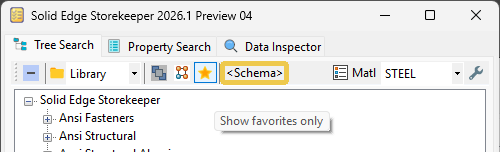
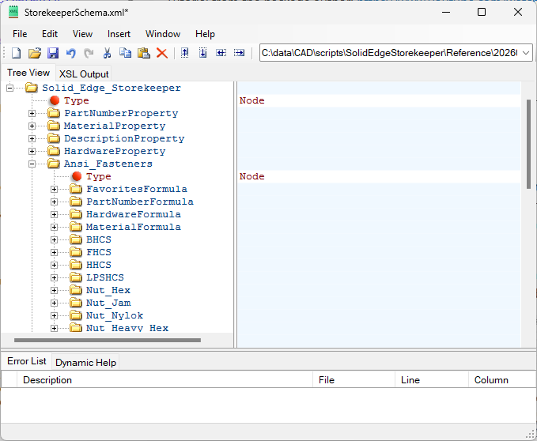
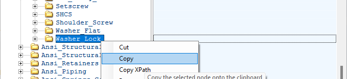
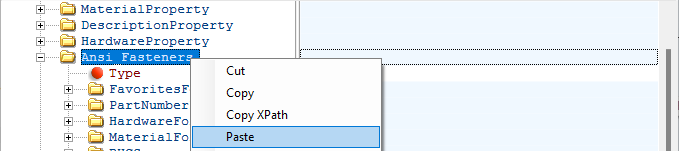
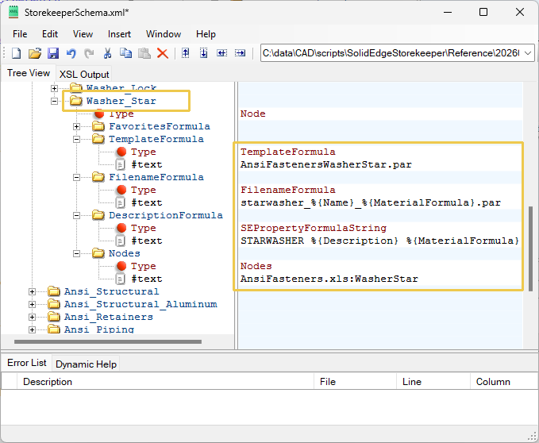
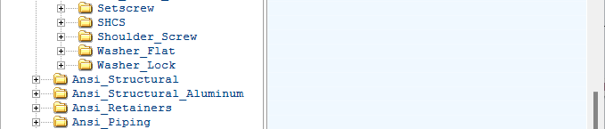


## Schema Mode

This a possible new way of defining the structure of the Storekeeper dataset.  Right now that is done in `Storekeeper.xls`, using indenting to represent heirarchy.  It is horrible.

This method uses XML, but only for the structure.  The part data is still kept in companion spreadsheets, where the tablular format is a natural fit.

### Creating the XML from Storekeeper.xls

If you have customized your dataset, this is a way to save your setup in the new format.  

Open the spreadsheet `Storekeeper.xls` and go to `Edit > Find and Replace`.   Set the `Find` text to `Nodes` and the `Replace` text to `Nodes Type="Nodes"`.  XML is very picky, so double-check your typing.  I won't think less of you if you copy/paste the `Replace` text from this write-up.  Once you're satisfied, click `Replace All`, then save and exit.

Delete (or rename) the old XML file, `Storekeeper.xml`.  Start Storekeeper and a new one will be created.  Rename it `StorekeeperSchema.xml`.

### Entering Schema Mode

Being experimental, this is being kept optional for now.  To toggle, \<SHIFT>-click the Favorites button, , on the toolbar.  When enabled, the text "\<Schema>" appears next to it.

<p align="center">
  
</p>

Enabling it doesn't immediately do anything.  It means that the next time the dataset is read, that mode will be used.  A quick way to re-read the dataset is to click the Favorites button (without \<SHIFT>).

### Editing the File

As noted, the file is called `StorekeeperSchema.xml`.  The program looks for it in `Preferences\DataSE2019` or `Preferences\DataSE2024`.

It is just a text file and you can edit it in Notepad.  However for anything except the most minor change, you will most likely want to use an XML editing program.

I use the free and open source XMLNotepad.  It was created and is actively maintined by Microsoft.  Here are a couple of links if you want to check it out.

[<ins>**Home Page**</ins>](https://microsoft.github.io/XmlNotepad/), 
[<ins>**Download**</ins>](https://microsoft.github.io/XmlNotepad/#install/), 
[<ins>**Tutorial**</ins>](https://www.youtube.com/watch?v=bmchxiu_oV0) (from the package author), and 
[<ins>**Help Documentation.**</ins>](https://microsoft.github.io/XmlNotepad/#help/overview/)

The program looks like this.

<p align="center">
  
</p>

It is easy to add new items to the dataset using copy/paste.  Right click an item and select Copy.

<p align="center">
  
</p>

Then scroll up to the category header, right click it and select Paste.

<p align="center">
  
</p>

Change the name and enter the relevant information.  To move it to a new location, drag it up or down the tree.

<p align="center">
  
</p>

To delete an item, select it and hit the Delete key.

<p align="center">
  
</p>

There's lots more you can do.  See the tutorial referenced above for details.

### Syntax

XML is very picky about syntax in the tag definitions.  A tag is anything that appears on the left pane of the interface, like `Ansi_Fasteners` or `PartNumberFormula` for example.

It is not at all picky about text associated with the tag, like the file name and other information shown above.

A valid tag name can only have letters, numbers, `_` (underscore), `.` (period), and `-` (minus).  It can't start with a number, or have space characters in it.  (Not sure about other alphabets.)

That means "good luck" with things like this: `1/4-20 x 1.000`.

Since I *want* things like that, we developed a workaround.  For illegal characters, we made "stand-ins" that are translated by Storekeeper when building the tree view of the library.  (The tree view is a Control in WinForms, not the underlying XML itself.  It is not picky about such things.)

You can't start with a number.  To get around that, prepend it with some text.  In the companion spreadsheets, that is done automatically by adding the Node name to the entry.  Keeping with the example, that gets us this far: `Size 1/4-20 x 1.000`.

For the space character, use `_` which is allowed.  Replace all other punctuation using the lookup table (below).  Instead of `/`, enter `.XmlForwardSlash.`.  Note the `.` before and after the name are part of the stand-in text.  You have to use them.

In this example to get `Size 1/4-20 x 1.000` in the tree, the XML would be `Size_1.XmlForwardSlash.4-20_x_1.000`.

It's kind of a pain and there may be a better way.  That's how it works for now, though.

The code that builds the lookup table is below.  First, a couple of things to note.  

- Any line preceeded by `'` (single quote) in the code is ignored.  Either because the character is already allowed, or you can't use it for other reasons.

- Any character not in the lookup table, for example `€` (Euro symbol), will not be translated.  It has to be on the list.  Let me know if you need one and I'll add it.

- You might be wondering why we haven't had to worry about all this before.  That is because previously Excel was used for everything.  When the program parses spreadsheets, it makes the necessary replacements automatically.  Since this new method *starts* with XML, we have to deal with it.  (Except the companion spreadsheets, which remain in Excel format.)

- One nice thing about XMLNotepad is that it won't *let* you enter an illegal character.  It complains right away.

Anyway, here's the code.

```
Me.StringToXmlDict = New Dictionary(Of String, String)
Me.StringFromXmlDict = New Dictionary(Of String, String)

Me.StringToXmlDict(" ") = "_"

Me.StringToXmlDict("!") = ".XmlExclamationMark."

'Me.StringToXmlDict(""")=".XmlDouble quotes (or speech marks)."

Me.StringToXmlDict("#") = ".XmlNumberSign."
Me.StringToXmlDict("$") = ".XmlDollarSign."
Me.StringToXmlDict("%") = ".XmlPercentSign."
Me.StringToXmlDict("&") = ".XmlAmpersand."
Me.StringToXmlDict("'") = ".XmlSingleQuote."
Me.StringToXmlDict("(") = ".XmlOpenParenthesis."
Me.StringToXmlDict(")") = ".XmlCloseParenthesis."
Me.StringToXmlDict("*") = ".XmlAsterisk."
Me.StringToXmlDict("+") = ".XmlPlus."
Me.StringToXmlDict(",") = ".XmlComma."

'Me.StringToXmlDict("-") = ".XmlMinus."
'Me.StringToXmlDict(".") = ".XmlPeriod."

Me.StringToXmlDict("/") = ".XmlForwardSlash."
Me.StringToXmlDict(":") = ".XmlColon."
Me.StringToXmlDict(";") = ".XmlSemicolon."

'Me.StringToXmlDict("<")=".XmlLess than (or open angled bracket)."
'Me.StringToXmlDict("=")=".XmlEquals."
'Me.StringToXmlDict(">")=".XmlGreater than (or close angled bracket)."

Me.StringToXmlDict("?") = ".XmlQuestionMark."

Me.StringToXmlDict("@") = ".XmlAtSign."
Me.StringToXmlDict("[") = ".XmlOpeningBracket."
Me.StringToXmlDict("\") = ".XmlBackslash."
Me.StringToXmlDict("]") = ".XmlClosingBracket."
Me.StringToXmlDict("^") = ".XmlCaret."

'Me.StringToXmlDict("_") = ".XmlUnderscore."

Me.StringToXmlDict("`") = ".XmlGraveAccent."
Me.StringToXmlDict("{") = ".XmlOpeningBrace."
Me.StringToXmlDict("|") = ".XmlVerticalBar."
Me.StringToXmlDict("}") = ".XmlClosingBrace."
Me.StringToXmlDict("~") = ".XmlTilde."

For Each Key In Me.StringToXmlDict.Keys
    Dim Value As String = Me.StringToXmlDict(Key)
    Me.StringFromXmlDict(Value) = Key
Next
```


