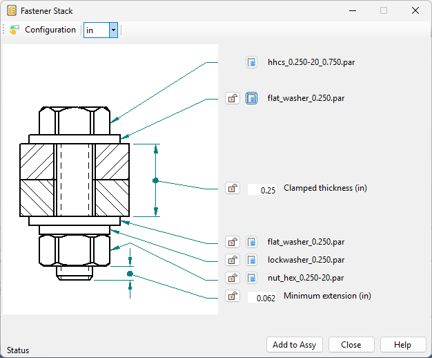
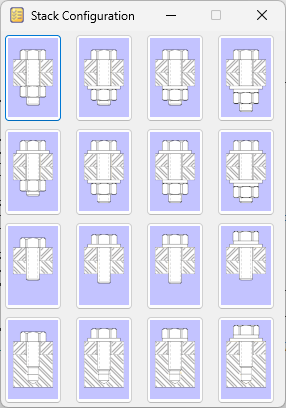
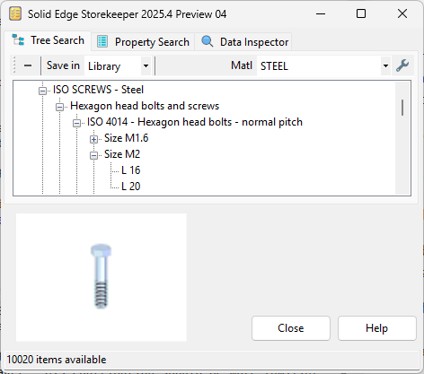
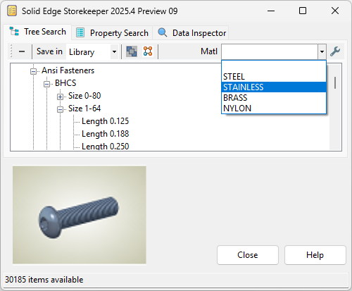
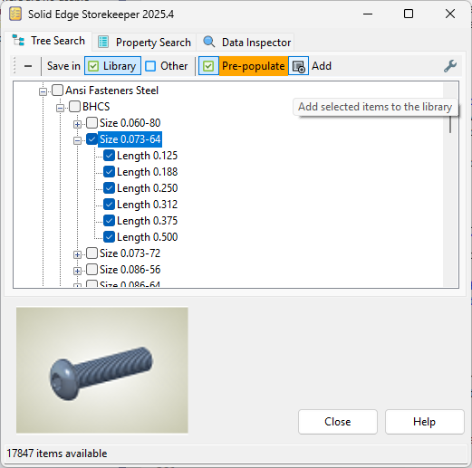

  

  
  

  Robert McAnany 2025

# Release Notes
Solid Edge Storekeeper is a utility to create, organize, and share standard parts.  It is free and open source and you can find it [<ins>**Here**</ins>](https://github.com/rmcanany/SolidEdgeStorekeeper#readme).  

Please note, the program has been tested on thousands of our files, but none of yours.  Do not run it on production work without testing on backups first.

Feel free to report bugs and/or ideas for improvement on the [<ins>**Solid Edge Forum**</ins>](https://community.sw.siemens.com/s/topic/0TO4O000000MihiWAC/solid-edge) or [<ins>**GitHub**</ins>](https://github.com/rmcanany/SolidEdgeStorekeeper/issues).

## V2025.4

We'll get right to the updates, but first some exciting news -- we have a new **Contributor!**  Our very own **@TeeVar** built and donated a massive ISO-native dataset, compatible back to SE2019.  He also provided a ton of great suggestions to enhance the capabilities of the program and make it easier to use.  Can't wait for you to see his handiwork!

Now, about those updates...

### Fastener Stacks

Added the ability to create fastener stacks -- a grouping that consists of a fastener and related components, such as washers and nuts.  

  

The stack styles are pre-configured.  There are eight versions that employ nuts, and four each for thru and blind tapped holes.  Note, you only choose the fastener.  The related components are automatically selected based on the fastener diameter and thread.

  

The program automatically finds the correct length fastener, creates temporary subassemblies of the top and bottom components, and adds and disperses them in turn to the main assembly.  Once you position the parts, they are added to an `Assembly Group` and patterned if applicable.

See the [<ins>**Fastener Stack**</ins>](https://github.com/rmcanany/SolidEdgeStorekeeper#fastener-stack) section of the Readme for details.

### Alternate Data and Templates

Contributed by **@TeeVar.**  Thank you!

Added new templates created with SE2019 for users who don't use SE2024 or later.  Included are ISO screws, nuts, washers, etc., EN structural steel, and more.  

  

Even if you have a newer version of SE, you may still want to use this data set.  **@TeeVar** is an ISO native speaker.  His contribution should be more familiar and useful to those who work with that standard.

See the [<ins>**Tree Search Options**</ins>](https://github.com/rmcanany/SolidEdgeStorekeeper#tree-search-options) section of the Readme for details.

### Drawings of Standard Parts

Added support for parts with associated drawings.  (Thank you **@Seva!**)

This can be helpful in cases where users work with simple parts, like a pipe with side holes, but still need a basic drawing to send to the shop.

If a file in the templates directory includes a drawing with the same name, the drawing is optionally copied when a new part is created.  It is renamed to match the new part and the links are updated accordingly.  Set the option on the **Tree Search Options** page.

See the [<ins>**Creating New Templates**</ins>](https://github.com/rmcanany/SolidEdgeStorekeeper#creating-new-templates) section of the Readme for details.

### Material Selection

Concept by **@TeeVar.**  Thank you!

Added the option to have multiple materials available in a single category.  This can dramatically reduce the size of the tree, which eliminates tedious scrolling for the user.

  

Select the material from the drop down list.  If an item only has one material defined, it is selected automatically.  If you go to a different item in the tree and its material list contains the currently active material, the selection is retained.  If you attempt to process an item and no material has been selected, the program reports an error.

See the [<ins>**Creating New Templates**</ins>](https://github.com/rmcanany/SolidEdgeStorekeeper#tree-search) section of the Readme for details.

### Property Cache

Added an option to store property values of files in the library.  Set it on the `Property Search` options dialog.  It is meant to speed up property searches for large libraries.  Previously all files were searched every time.

### Other

- Added the ability to set standard parts name and location interactively (Thank you **@TeeVar!**).  On the toolbar, set the `Save in` option to `Assy Dir` or `Other` to enable it.  Previously that option was set in the spreadsheet.

- Added the ability to use subdirectories in file names (Thank you again **@TeeVar!**).  The file names are specified in the spreadsheet.  To include subdirectories, simply preceed the file name with the directory names, eg. `Fasteners\BHCS\bhcs_%{Name}_%{Length}.par`.

- Added an option to keep the Storekeeper window always on top (Thank you one more time **@TeeVar!**).

- Added the ability to use special characters (`/`, `*`, `@`, etc.) in Xml tag definitions  (Thank you **@Seva!**).  Normally these are not allowed.  To get around it, special characters are replaced with compatible stand-ins where necessary.  If you look in `Storekeeper.xml`, you may see text like `.XmlComma.`  That's one of those stand-ins.

- Temporarily disabled the `Pre-Populate` feature from the previous version (Sorry **@Seva!**).  It is not currently compatible with multiple materials per category.  In particular it had trouble when a material is valid for one selected item, but not another.  You can still use the previous version when that feature is needed.

- Moved the options `Always on top` and `Auto pattern` to the main toolbar.  Previously they were on the Tree Search Options page.  The idea was to reduce distraction and save a couple of clicks for these frequently toggled settings.

## V2025.3

### Replace Part

Contributed by **@[Francesco Arfilli].**  Thank you!

Added the ability to replace selected parts in the assembly.

- `Replace selected`  Replaces a selected part in the assembly.
- `Replace all`  Replaces all occurrences of a selected part in the assembly.

### Update Template File in Background

Contributed by **@[Francesco Arfilli]**.  Thank you!

Changed the template updating process for new parts.  The update can now occcur in the background.  Set the option on the Tree Search Options dialog.  Running in the background speeds up processing and eliminates the unexplained and confusing presence of a new part file in the interface.

### Pre-populate Library

Added the ability to selectively add items to the library ahead of time. (Thank you **@Seva!**)

To select an item, enable its checkbox.  Checking on a category header selects all items below it.  You can select a category, then de-select any items you don't want included.  Once satisfied with the selection, click `Add to library` to start the process.

See the [<ins>**Pre-Populating the Library**</ins>](https://github.com/rmcanany/SolidEdgeStorekeeper#pre-populating-the-library) section of the Readme for details.

### Other

Fixed an issue where accessing certain file properties was causing an exception.  (Contributed by **@[Francesco Arfilli].**  Thank you!)

The following were all reported by **@TeeVar**.  Thank you!

- Fixed an issue where the form settings were not being saved in certain conditions.

- Fixed an issue where moving the program to a new directory did not allow the user to access the interface to update file locations.  

- Fixed an issue where the program was halting when Solid Edge versions prior to V2020 were being used.

- Fixed an issue where new standard parts were not being saved to the `Library` directory.

- Fixed an issue where commas were replaced with periods in variables and properties.  The fix is somewhat experimental.  Enable the `Allow comma delimiters` on the Tree Search Options dialog to try it.

## V2025.2

### Generate Xml File

Fixed an issue where locales with a comma decimal separator were getting invalid Xml headers, keeping the program from functioning.

### Readme

Added a section with things to consider when creating new templates.

Clarified the fact that the supplied templates were created in SE2024 and cannot be used with older versions.

## V2025.1
Initial release.
